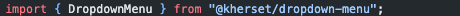
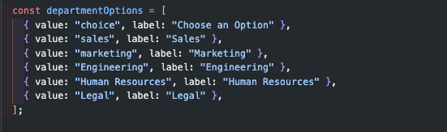

# Module - Dropdown menu

Thank you for downloading this module allowing you to use a customizable dropdown menu. To include it in your project, here are the steps to follow:

# Prerequisites

- Node.js v16.15.1
- React.js v18.2.0
- Please make sure you have the right versions and download both packages. You can verify this by using the following commands in your terminal:

# Check Node.js version

node -v

# Check React version

npm list react

# Instructions

- Installation : npm install @kherset/dropdown-menu
- import { DropdownMenu } from "@kherset/dropdown-menu" in your project
- To configure the dropdown menu, Please refer to the JSDoc on this page: https://github.com/Kherset/dropdown-menu/blob/master/dist/components/DropDownMenu.js

# Examples

# Screenshots

